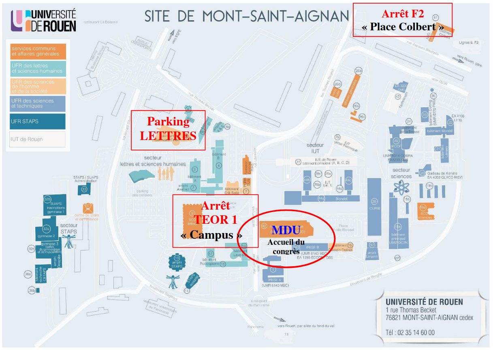

\addtolength{\headheight}{1.0cm} 
\pagestyle{fancyplain} 
\rhead{\includegraphics[height=2.4cm]{images/logo_cahiers.png}} 
\lhead{\includegraphics[height=2.4cm]{images/r.png}}
\renewcommand{\headrulewidth}{0pt}

## Objectifs de la formation :  

• Assimiler les concepts R (les objets, les fonctions, les packages)  
• Importer et exporter des données  
• Manipuler des individus et des variables  
• Réaliser des statistiques descriptives   

La seule contrainte pour vous sera de venir avec un ordinateur portable sur lequel sera installé R & RStudio.   
  
Elle sera centrée sur les fondamentaux et la prise en main du logiciel R.  

**Aucune connaissance en programmation n’est nécessaire pour participer à cette formation.**  

Cette formation de deux journées a un programme prévisionnel qui s’organise sur deux axes :  

• Introduction à la programmation et aux structures de données R  
• Production de statistiques descriptives et création de graphiques  

## Inscription à la formation :  

Vous pouvez vous inscrire en cliquant sur le lien suivant : https:// enquetes.univ-rouen.fr/ 456439  

Date limite d’inscription (25 places) : 08/04/2022   

## Programme détaillé :  

| Date           | Horaire     | Salle                                         | Programm                                    |
|----------------|-------------|-----------------------------------------------|---------------------------------------------|
| Lundi 25 Avril | 09h00-12h30 | divisible Nord - Maison de l'Université       | Présentation de la formation, concepts de R |
| Lundi 25 Avril | 14h00-17h00 | divisible Nord - Maison de l'Université       | Explorer la base de données                 |
| Mardi 26 Avril | 09h00-12h30 | divisible Nord - Maison de l'Université       | Manipule et représenter des données         |
| Mardi 26 Avril | 14h00-17h00 | divisible Nord - Maison de l'Université       | Traitements statistiques                    |

***  

## Les données :  

Le développement des technologies s’est accompagné d’une production massive de données, le Big Data. De
nombreuses institutions et organisations à but non lucratif se sont engagées dans une mise à disposition
des données. Et depuis quelques années, l’accès à ces données est facilité à travers le développement de
plateformes ou d’API. Des plateformes mettent à disposition de nombreuses données pour les chercheurs,
journalistes, élus et citoyens. Les données utilisées pour cette formation sont produites par la police de
New-York et disponibles sur le site du https://data.cityofnewyork.us/. Il s’agit d’un ensemble de statistiques
sur les crimes à New-York entre 2016-2018.  

***  

**Adresse :** Maison De l’Université - Bâtiment numéro 8 - 3, Place Emile Blondel, 76130 Mont-Saint-Aignan**

***

## Pour se rendre à la MDU (Depuis la gare de Rouen Rive Droite)  

• En bus (environ 20 minutes) : Prendre le bus F2, à la station Gare Rue Verte en direction de La Vatine -
Centre Commercial MT-ST-AIGNAN. Descendre à la station Place Colbert. 2 possibilités : 1) Marcher
à pied (environ 7 minutes) en direction du 3 Place Emile Blondel 2) Rejoindre l’arrêt de TEOR de
la Place Colbert (l’arrêt se situe derrière la librairie Colbert) et prendre le T1 en direction de CHU
Charles Nicolle ROUEN, puis descendre à l’arrêt Campus.  
• En Téor : Prendre le T1 direction Mont aux malades, arrêt Campus  
• En taxi: Une station de taxi se trouve à la sortie de la gare, sur la droite.  
• En voiture : Parking des Pommiers, Faculté des Lettres et Sciences humaines  

***

Pour toute question complémentaire ou en cas de problème, n’hésitez pas à nous contacter :  

• equipe-formations-idees@listes.univ-rouen.fr  